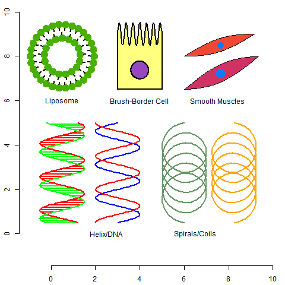

# Package BioShapes

## Description
The main purpose of this package is to facilitate the generation of graphical objects resembling biological and chemical entities, enabling the construction of diagrams based on these objects. It currently includes functions to generate diagrams depicting viral particles, liposomes, double helix / DNA strands, various cell types (like neurons, brush-border cells and duct cells), Ig-domains, as well as more basic shapes.

It should offer researchers in the field of biological and chemical sciences a tool to easily generate diagrams depicting the studied biological processes.

## Authors

1. Author, Maintainer: L. Mada

Continuous previous projects:

2. B.Sc. Thesis Adrian Cotoc (2022 - 2023);
> https://github.com/Adi131313/BioShapes
3. B.Sc. Thesis Darian Voda (2021 - 2022);

